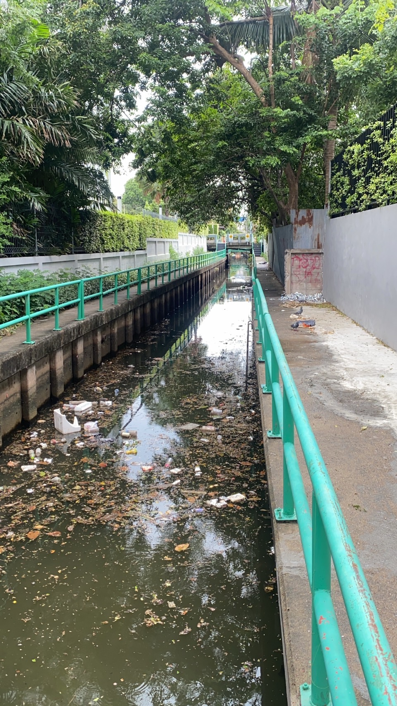
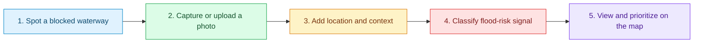

<p align="center">
  
</p>

<p align="center">
  
</p>

<p align="center">
  <strong>A community reporting prototype for detecting river and drainage waste before it becomes a flood risk.</strong>
</p>

<p align="center">
  <a href="#quick-start"></a>
  <a href="#how-it-works"></a>
  <a href="#technology"></a>
</p>

<p align="center">
  
  
  
</p>

<p align="center">
  
</p>

> [!NOTE]
> **Awarded 1st Runner-Up** at **UTCC AI Hackathon 2026: The STEM Innovation**, with a **10,000 THB scholarship**.

## The Problem

When waste blocks a canal or drain, a small obstruction can become a flooding emergency. The people who see the problem first are often the people who have no quick way to report it with useful context.

**AquaGuardian makes a report visible, locatable, and easier to prioritize.**

| What people see | What AquaGuardian captures | What teams can act on |
| :--- | :--- | :--- |
| Waste, weeds, sediment, or high water | Photo, location, description, and risk category | A map-based queue of issues that need attention |

## How It Works



## What You Can Do

<table>
  <tr>
    <td width="33%" valign="top">
      <h3>Capture the evidence</h3>
      Upload a photo, add a short description, and let the browser attach the current location.
    </td>
    <td width="33%" valign="top">
      <h3>Spot flood-risk signals</h3>
      Reports are categorized around waste, vegetation, sediment, and water-level risk.
    </td>
    <td width="33%" valign="top">
      <h3>See the citywide picture</h3>
      A map and dashboard help users compare reports and identify areas that need attention.
    </td>
  </tr>
</table>

> [!IMPORTANT]
> This is an interactive prototype. The current image-classification result is simulated so the demo runs without an API key or backend. A production release should move image analysis and report storage to secured server-side services.

## Technology

| Layer | Tools |
| :--- | :--- |
| Interface | React 19, React Router, Tailwind CSS |
| Mapping | Leaflet, React Leaflet, Carto tiles |
| Weather context | Open-Meteo public API |
| Build tooling | Vite 8, ESLint |
| Icons | Lucide React |

## Quick Start

```bash
git clone https://github.com/betauzi/AquaGuardian.git
cd AquaGuardian
npm install
npm run dev
```

Open the Vite URL shown in the terminal, usually `http://localhost:5173`.

| Command | Purpose |
| :--- | :--- |
| `npm run dev` | Start the local development server |
| `npm run build` | Create a production build |
| `npm run lint` | Check code quality |
| `npm run preview` | Preview the production build locally |

## Project Map

```text
src/
  pages/
    LandingPage.jsx     Mission and entry point
    UploadReport.jsx    Photo report workflow
    Dashboard.jsx       Map, weather, and report overview
  simulatedReports.js   Demo flood-risk reports
  App.jsx               Routes and mobile-style application shell
public/simulated/       Demo images used by the prototype
```

## Build It Into a Real Service

The prototype is deliberately keyless. For a production rollout, add a protected backend for:

- Image analysis and confidence scoring
- Authenticated report submission and moderation
- Secure storage for uploaded photos
- Routing reports to local response teams
- Notifications when a high-risk area receives multiple reports

Keep all credentials server-side. Do not put API keys in React source code or browser environment variables.

## License

No license has been declared for this repository. Add a `LICENSE` file before distributing or accepting external contributions.
